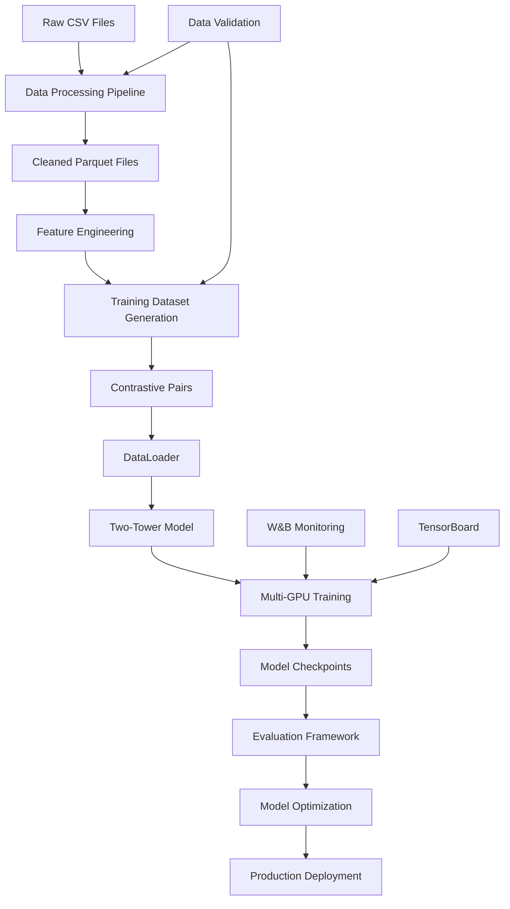

# 🏗️ H&M Deep Learning Project Architecture

## 📋 **Executive Summary**

This document outlines the complete enterprise-grade architecture for building a production-ready two-tower recommendation system for H&M. The project follows big tech standards with data contracts, scalable infrastructure, and performance-optimized implementations.

### **Project Goals**
- Build state-of-the-art two-tower embedding model
- Achieve Recall@50 > 10% (minimum enterprise standard)
- Handle 34M+ transaction records in production
- Support real-time inference at scale
- Implement robust evaluation and monitoring

### **Technical Stack**
- **Framework**: PyTorch 2.6+ with CUDA 12.4
- **Infrastructure**: Multi-GPU distributed training (DDP)
- **Data Processing**: Polars + Pandas + Dask for scalability
- **Experiment Tracking**: Weights & Biases + TensorBoard
- **Model Serving**: ONNX + TorchScript for production

---

## 🎯 **Major Task Breakdown**

### **Task 1: Data Engineering & Preprocessing Pipeline**
**Priority**: 🔴 Critical (Foundation)
**Timeline**: 3-4 days
**Dependencies**: Raw data availability

### **Task 2: Dataset & DataLoader Implementation**
**Priority**: 🔴 Critical (Training foundation)
**Timeline**: 2-3 days
**Dependencies**: Task 1 output

### **Task 3: Two-Tower Model Architecture**
**Priority**: 🔴 Critical (Core ML)
**Timeline**: 2-3 days
**Dependencies**: Task 2 output

### **Task 4: Multi-GPU Training Infrastructure**
**Priority**: 🟡 High (Performance)
**Timeline**: 2-3 days
**Dependencies**: Task 3 output

### **Task 5: 4-Phase Training Pipeline**
**Priority**: 🔴 Critical (Model quality)
**Timeline**: 5-7 days
**Dependencies**: Tasks 2, 3, 4

### **Task 6: Evaluation & Validation Framework**
**Priority**: 🟡 High (Quality assurance)
**Timeline**: 2-3 days
**Dependencies**: Task 5 output

### **Task 7: Model Optimization & Deployment**
**Priority**: 🟢 Medium (Production)
**Timeline**: 3-4 days
**Dependencies**: Task 6 output

---

## 📊 **Data Contracts (Big Tech Standards)**

### **Contract 1: Raw Data Processing**
**File**: `CONTRACT_1_RAW_PROCESSING.md`

```yaml
data_contract:
  name: "Raw Data Processing"
  version: "1.0.0"
  owner: "Data Engineering Team"

input:
  sources:
    - path: "data/raw/articles_filtered.csv"
      format: "CSV"
      encoding: "UTF-8"
      size: "4.9MB"
      records: 15_581
    - path: "data/raw/customers_filtered.csv"
      format: "CSV"
      encoding: "ASCII"
      size: "4.1MB"
      records: 28_317
    - path: "data/raw/transactions_train_2M.csv"
      format: "CSV"
      encoding: "ASCII"
      size: "11MB"
      records: 100_000

  validation:
    schema_validation: true
    null_threshold: 0.05
    duplicate_threshold: 0.001

processing:
  operations:
    - name: "Data Cleaning"
      actions:
        - Remove duplicate transactions
        - Handle missing values in FN/Active columns
        - Validate referential integrity
    - name: "Feature Engineering"
      actions:
        - Create user interaction sequences
        - Generate item popularity scores
        - Calculate temporal features
        - Build user-item interaction matrix
    - name: "Statistical Analysis"
      actions:
        - Generate data profile report
        - Calculate class distribution
        - Analyze temporal patterns

output:
  files:
    - path: "data/processed/articles.parquet"
      format: "Parquet"
      compression: "snappy"
      partitioning: "product_group_name"
    - path: "data/processed/customers.parquet"
      format: "Parquet"
      compression: "snappy"
    - path: "data/processed/transactions.parquet"
      format: "Parquet"
      compression: "snappy"
      partitioning: ["year", "month"]
    - path: "data/processed/user_item_interactions.parquet"
      format: "Parquet"
      compression: "snappy"

  quality_gates:
    - "No null customer_ids in transactions"
    - "All transaction dates within valid range"
    - "Referential integrity maintained"
    - "Processing time < 10 minutes for local dataset"

  metrics:
    - throughput: "records/second"
    - data_quality_score: "0-100"
    - processing_time: "seconds"
```

### **Contract 2: Training Dataset Generation**
**File**: `CONTRACT_2_TRAINING_DATASET.md`

```yaml
data_contract:
  name: "Training Dataset Generation"
  version: "1.0.0"
  owner: "ML Engineering Team"

input:
  sources:
    - path: "data/processed/transactions.parquet"
      format: "Parquet"
    - path: "data/processed/articles.parquet"
      format: "Parquet"
    - path: "data/processed/customers.parquet"
      format: "Parquet"

  requirements:
    memory: "8GB minimum"
    storage: "50GB available space"
    compute: "4+ CPU cores"

dataset_generation:
  strategy: "Contrastive Learning with Hard Negatives"

  phases:
    - name: "Negative Sampling"
      methods:
        - type: "Random Negatives"
          count: 10
          per_positive: true
        - type: "In-batch Negatives"
          automatic: true
        - type: "Hard Negatives"
          source: "Item-Item Collaborative Filtering"
          top_k: 1000
          sample_size: 5

    - name: "Sequence Construction"
      max_sequence_length: 50
      padding_strategy: "post"
      truncation: true

    - name: "Category Balancing"
      method: "Inverse Frequency Weighting"
      alpha: 0.5

output:
  files:
    - path: "data/train/train_dataset.parquet"
      format: "Parquet"
      compression: "zstd"
      partitioning: ["split"]
      splits: ["train", "val", "test"]
      ratios: [0.8, 0.1, 0.1]

    - path: "data/train/item_similarity_matrix.parquet"
      format: "Parquet"
      compression: "snappy"

    - path: "data/train/vocabulary.json"
      format: "JSON"
      content: "mappings for categorical features"

  dataset_schema:
    user_features:
      - "customer_id": "string"
      - "age": "int16"
      - "club_member_status": "categorical"
      - "fashion_news_frequency": "categorical"

    item_features:
      - "article_id": "string"
      - "product_group_name": "categorical"
      - "color_group_name": "categorical"
      - "price_bucket": "categorical"

    interaction_features:
      - "label": "float32"  # 1.0 for positive, 0.0 for negative
      - "timestamp": "datetime64"
      - "sales_channel_id": "int8"

  quality_gates:
    - "No data leakage between splits"
    - "Minimum 10 negatives per positive"
    - "Category distribution preserved"
    - "Temporal ordering maintained"

  performance_requirements:
    - generation_time: "< 30 minutes"
    - memory_efficiency: "< 16GB peak"
    - io_efficiency: "> 1000 records/second"
```

### **Contract 3: Model Architecture**
**File**: `CONTRACT_3_MODEL_ARCHITECTURE.md`

```yaml
model_contract:
  name: "Two-Tower Embedding Model"
  version: "1.0.0"
  owner: "ML Research Team"

architecture:
  type: "Two-Tower Neural Network"
  paradigm: "Contrastive Learning"

  user_tower:
    input_dim: 128  # After feature engineering
    layers:
      - type: "Embedding"
        embedding_dim: 64
        vocab_sizes:
          - club_member_status: 5
          - fashion_news_frequency: 5
      - type: "Dense"
        units: [256, 128, 64]
        activation: "ReLU"
        dropout: 0.15
      - type: "BatchNorm"
        after_each_dense: true
    output_dim: 128

  item_tower:
    input_dim: 256  # After feature engineering
    layers:
      - type: "Embedding"
        embedding_dim: 64
        vocab_sizes:
          - product_group_name: 20
          - color_group_name: 50
          - garment_group_name: 50
      - type: "Dense"
        units: [512, 256, 128]
        activation: "ReLU"
        dropout: 0.15
      - type: "BatchNorm"
        after_each_dense: true
    output_dim: 128

  contrastive_head:
    type: "Projection Head"
    layers:
      - Dense(256, ReLU)
      - Dense(128)  # Final embedding space

training_objectives:
  - "InfoNCE Loss"
  - "BPR Loss" (Phase 1 only)
  - "Category Alignment Loss" (Phase 3 only)

hyperparameters:
  embedding_dim: 128
  temperature: 0.08
  dropout_rate: 0.15
  weight_decay: 1e-5

  optimization:
    optimizer: "AdamW"
    learning_rates: [1e-3, 0.032, 5e-5]  # Phase-specific
    weight_decay: 1e-5

output:
  model_files:
    - path: "checkpoints/best_model.pt"
      format: "PyTorch State Dict"
      content: "Full model architecture"
    - path: "checkpoints/user_tower.pt"
      format: "PyTorch State Dict"
      content: "User tower only"
    - path: "checkpoints/item_tower.pt"
      format: "PyTorch State Dict"
      content: "Item tower only"
    - path: "artifacts/model_config.json"
      format: "JSON"
      content: "Model hyperparameters and architecture"

  deployment_files:
    - path: "artifacts/user_tower.onnx"
      format: "ONNX"
      optimization: "FP16"
    - path: "artifacts/item_tower.onnx"
      format: "ONNX"
      optimization: "FP16"

  performance_requirements:
    inference_latency: "< 10ms per user"
    throughput: "> 1000 predictions/second"
    memory_usage: "< 1GB for both towers"
    model_size: "< 100MB total"
```

### **Contract 4: Multi-GPU Training**
**File**: `CONTRACT_4_TRAINING_INFRASTRUCTURE.md`

```yaml
training_contract:
  name: "Multi-GPU Training Infrastructure"
  version: "1.0.0"
  owner: "ML Infrastructure Team"

hardware_requirements:
  minimum:
    gpus: 2
    gpu_memory: "16GB per GPU"
    system_memory: "64GB"
    storage: "500GB SSD"

  recommended:
    gpus: 4-8
    gpu_memory: "24GB per GPU (A100/V100)"
    system_memory: "256GB"
    storage: "1TB NVMe"

distributed_training:
  framework: "PyTorch DDP (DistributedDataParallel)"
  backend: "nccl"

  optimization_techniques:
    - "Mixed Precision Training (FP16)"
    - "Gradient Accumulation"
    - "Gradient Checkpointing"
    - "Dynamic Loss Scaling"

  memory_optimization:
    - "ZeRO Stage 1" (Optimizer state partitioning)
    - "CPU Offloading" (if GPU memory constrained)

training_phases:
  phase_1:
    name: "Cold Start Embedding Convergence"
    epochs: 2-3
    batch_size: 2048
    learning_rate: 1e-3
    scheduler: "constant"
    loss: "BPR + L2 regularization"

  phase_2:
    name: "Large-Batch Contrastive Learning"
    epochs: 3-5
    batch_size: 8192
    learning_rate: "cosine decay 0.032 → 5e-4"
    scheduler: "cosine_annealing"
    loss: "InfoNCE"
    mixed_precision: true

  phase_3:
    name: "Hard Negative Mining"
    epochs: 2-3
    batch_size: 4096
    learning_rate: 5e-5
    scheduler: "constant"
    loss: "InfoNCE + Category Alignment"

  phase_4:
    name: "Embedding Stabilization"
    epochs: 1
    batch_size: 2048
    learning_rate: "linear decay to 1e-5"
    ema_decay: 0.999
    loss: "Positive pairs only"

monitoring:
  metrics:
    - "Recall@50"
    - "NDCG@10"
    - "Training Loss"
    - "GPU Utilization"
    - "Memory Usage"

  logging:
    framework: "Weights & Biases + TensorBoard"
    frequency: "every 100 steps"

output:
  artifacts:
    - training_logs: "logs/training/"
    - checkpoints: "checkpoints/"
    - metrics: "metrics/training_metrics.json"
    - visualizations: "plots/"

  quality_gates:
    - recall_50_threshold: ">= 0.10"
    - convergence_check: "loss_improvement > 1%"
    - memory_efficiency: "gpu_utilization > 80%"

performance_requirements:
  throughput: "> 10K samples/second/GPU"
  scalability: "linear speedup up to 8 GPUs"
  memory_efficiency: "< 90% GPU memory usage"
```

---

## 🔄 **Data Flow Architecture**



---

## 🎯 **Success Metrics & KPIs**

### **Model Quality Metrics**
- **Recall@50**: > 10% (minimum enterprise standard)
- **NDCG@10**: > 0.15
- **Coverage**: > 80% of catalog
- **Cold Start Performance**: < 20% degradation for new users

### **System Performance Metrics**
- **Training Throughput**: > 10K samples/second/GPU
- **Inference Latency**: < 10ms per user
- **Memory Efficiency**: < 1GB for both towers
- **Scalability**: Linear speedup up to 8 GPUs

### **Data Quality Metrics**
- **Data Freshness**: < 24 hours processing lag
- **Data Completeness**: > 99.9% record completeness
- **Schema Consistency**: 100% schema validation pass rate

---

## 🚨 **Risk Assessment & Mitigation**

### **Technical Risks**
1. **Memory Constraints**: Mitigate with gradient checkpointing and ZeRO
2. **Data Imbalance**: Use category-aware sampling and loss weighting
3. **Cold Start Problem**: Implement content-based fallback strategies
4. **Scalability Bottlenecks**: Design for horizontal scaling from day one

### **Business Risks**
1. **Poor Recommendation Quality**: Rigorous evaluation with business metrics
2. **Infrastructure Costs**: Optimize for cost-efficiency without performance loss
3. **Deployment Complexity**: Containerize and automate deployment pipelines

---

## 📅 **Project Timeline**

### **Week 1: Foundation**
- Days 1-2: Data processing pipeline
- Days 3-4: Dataset generation
- Days 5-7: Basic model architecture

### **Week 2: Training Infrastructure**
- Days 1-3: Multi-GPU training setup
- Days 4-5: Evaluation framework
- Days 6-7: Initial training experiments

### **Week 3: Model Optimization**
- Days 1-3: 4-phase training implementation
- Days 4-5: Hyperparameter optimization
- Days 6-7: Final model tuning

### **Week 4: Production Readiness**
- Days 1-2: Model optimization (ONNX, quantization)
- Days 3-4: Deployment pipeline
- Days 5-7: Production testing and monitoring

---

**Last Updated**: 2025-11-10
**Architecture Version**: 1.0.0
**Next Review**: Upon completion of Phase 1 training